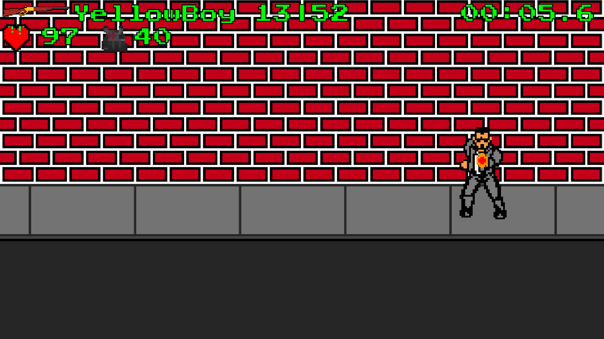
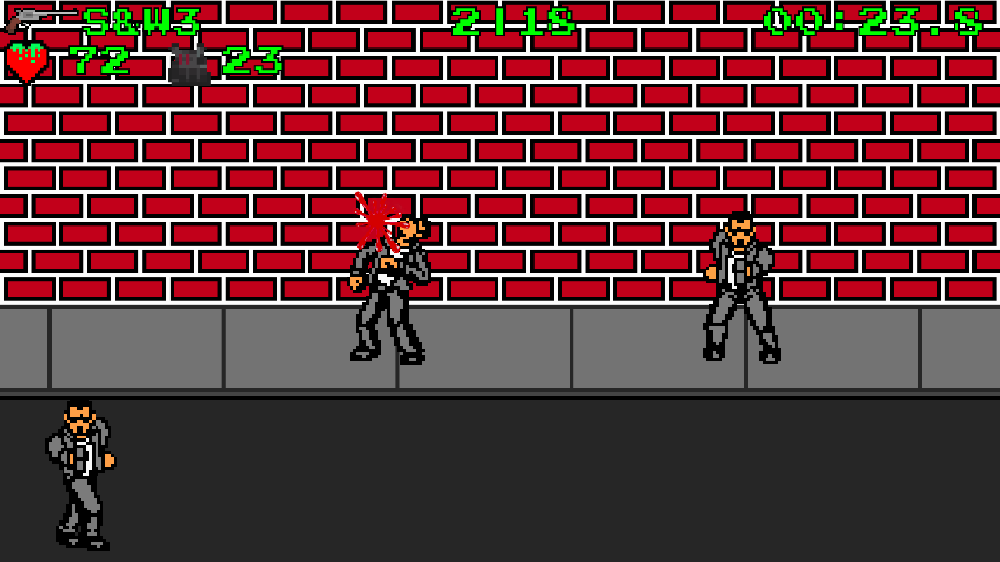

<h1>shooter-game</h1>

It is a retro shooter web game, made with vanilla js.

<h2>Controls:</h2>
<ul>
  <li>Fullscreen: Browser depend (F11)</li>
  <li>Zoom: Browser depend (Ctrl +-)</li>
  <li>Shoot: Left Click</li>
  <li>Reload: R, Wheel Click</li>
  <li>Change Gun: Q, 1-2, Wheel Scrolling</li>
</ul>
<h3>TODOS:</h3>
<ul>
  <li>story</li>
  <li>cover system</li>
  <li>crosshair choosing</li>
  <li>adrenalin, for faster firerate, reload, slower enemies, reduced bleeding, and some % hp plus, and has a bigger accuracy for guns</li>
  <li>bleeding cause a worst accuracy</li>
  <li>enemy frome left, at run die fall to right</li>
  <li>need a giveup button or something, to escape the menu</li>
</ul>
